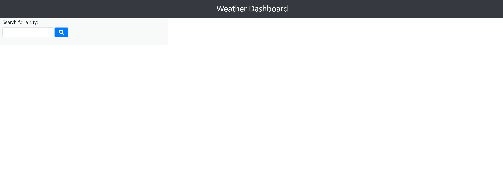

# Weather-Dashboard

## The Repository

The link to the website repository: [Website Repo link](https://github.com/NavdeepDP/Weather-Dashboard)

The site is published at [Published Website link](https://navdeepdp.github.io/Weather-Dashboard/)

## Development Environment
Code is developed in VS code Studio

## Website Functionality

 - Weather Dashboard functionality as below:

 

## Installation

- Code is developed using VS Code studio.
- Code is available at the GITHub repository link: [Website Repo link](https://github.com/NavdeepDP/Weather-Dashboard)
- Get the code code in your local machine by using the clone option in the repository link.
- Click "Code" and copy the Clone with SSH key link.
- In Git bash, go to the appropriate directory and get the code using "git clone" command.
- Open index.html. Right click and open in browser of your choice to view the website.

## References

- [w3schools.com](https://www.w3schools.com/)
- [MDN web docs](https://developer.mozilla.org/en-US/docs/Web/JavaScript)
- [Bootstrap](https://getbootstrap.com/docs/4.4/getting-started/introduction/)
- [JQuery](https://api.jquery.com/)
- [Moment.js](https://momentjs.com/)
- [OPenWeather API](https://openweathermap.org/guide)

